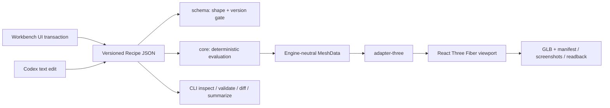

# アーキテクチャと判断境界

## Recipeを中心にした対称性

Workbenchの入力欄、TransformControls、Undo/RedoはすべてRecipe全体に対するtransactionとして扱われます。Three.jsのObject3DやReact stateを永続化せず、保存ファイルを再読込したときはRecipeだけから同じSceneを再構築します。CodexがJSONを直接編集した場合も`parseRecipe`と`validateRecipe`を通るため、人間のUI操作と検証経路が分岐しません。

## 決定論

生成処理は`generationSeed`と各Variant/Placement/Splineのlocal seed、Stable IDを組み合わせて`SeededRng`を初期化します。生成経路で`Math.random()`は使用しません。Placementは同じRecipeとseedから同じTransform列を返し、Variantは元Materialをcloneしてから色差分を適用します。

Recipe hashはkey順序を正規化したJSONへFNV-1aを適用した、軽量な同一性識別子です。暗号学的署名ではありません。

## Spline Sweep

Spline samplingは制御点数だけでなく、概算経路長、接線角度の変化、radius/width/height keyframeの変化量から分割数を決め、`minSegments`と`maxSegments`へclampします。各frameは直前normalを新しいtangent平面へ射影するparallel-transport相当の更新を使い、垂直方向や急角度での断面反転を抑えます。

共通frame列から次の断面を作ります。

| sweepType | 断面 | 主な用途 | v0.1の端部 |
|---|---|---|---|
| rod | 10角形の閉断面 | 杖、レール、配管 | 開放 |
| road | 左右2頂点の平面 | 道、帯状面 | 開放 |
| corridor | 床・右壁・天井・左壁 | 通路volume | 入口・出口を開放 |

連続する制御点が重なる場合はValidation warningを返します。自己交差する極端な曲率や、幅が曲率半径を大きく超える入力の完全な解消はv0.1の対象外です。

## DefinitionとInstance Override

Asset DefinitionはPartのPrimitive、transform、Material参照を所有します。Scene InstanceはAsset Stable IDとScene transform、任意のPart Overrideだけを所有します。

- Definition編集はそのAssetを参照するすべてのInstanceへ反映されます。
- Instance Overrideは対象Instanceの解決結果だけを変えます。
- `Revert override`は選択Partの個別差分を削除します。
- `Apply to definition`は個別Material差分を共有Definitionへ移し、元Instanceの差分を削除します。
- Top barの`Revert`は最後にSave/OpenしたRecipe全体へ戻します。
- `Reset`は汎用starter projectへ戻します。

## 派生出力

GLB exporterは選択Assetだけをブラウザ内で実変換します。同時に生成するmanifestのvertex/triangle/bounds/material統計も、その選択Assetに限定しています。Visual ProofのreadbackはRecipe全体のCore統計を記録します。

Node版GLTFExporterへ依存せず、ブラウザ実行でArrayBufferが空でないことをsmoke testします。GLBをScene全体、Spline、Roomまで束ねるexportは未実装です。

## 現在の制約

- JSON Schema 0.1.0は明示的version gateを持ちますが、過去versionからのmigrationはまだありません。
- Spline control pointとprofile keyframeはRecipeで表現できますが、v0.1 UIは断面切替と先頭profile値の編集までです。
- GLB export対象は選択Asset Definitionです。Scene bundleやplacement展開結果は未対応です。
- Primitive geometryはレビュー用途の中立MeshDataで、UVやtangent、textureは持ちません。
- 初期JavaScript bundleはThree/R3Fを含むため約1.3 MB（gzip約369 KB）です。v0.1ではローカルworkbenchの機能一貫性を優先しています。
- レスポンシブ表示ではviewportを守るためside panelを隠しますが、詳細編集はdesktopを主対象にしています。
