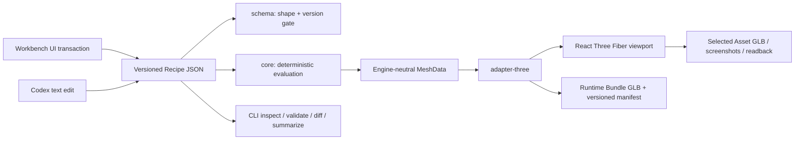

# アーキテクチャと判断境界

## Recipeを中心にした対称性

Workbenchの入力欄、Spline作成・点操作、TransformControls、Undo/RedoはすべてRecipe全体に対するtransactionとして扱われます。Three.jsのObject3DやReact stateを永続化せず、保存ファイルを再読込したときはRecipeだけから同じSceneを再構築します。CodexがJSONを直接編集した場合も`parseRecipe`と`validateRecipe`を通るため、人間のUI操作と検証経路が分岐しません。

## 決定論

生成処理は`generationSeed`と各Variant/Placement/Splineのlocal seed、Stable IDを組み合わせて`SeededRng`を初期化します。生成経路で`Math.random()`は使用しません。Placementは同じRecipeとseedから同じTransform列を返し、Variantは元Materialをcloneしてから色差分を適用します。

Recipe hashはkey順序を正規化したJSONへFNV-1aを適用した、軽量な同一性識別子です。暗号学的署名ではありません。

## Spline Sweep

Spline samplingは制御点数だけでなく、概算経路長、接線角度の変化、radius/width/height keyframeの変化量から分割数を決め、`minSegments`と`maxSegments`へclampします。各frameは直前normalを新しいtangent平面へ射影するparallel-transport相当の更新を使い、垂直方向や急角度での断面反転を抑えます。

共通frame列から次の断面を作ります。

| sweepType | 断面 | 主な用途 | v0.2の端部 |
|---|---|---|---|
| rod | 10角形の閉断面 | 杖、レール、配管 | 開放 |
| road | 左右2頂点の平面 | 道、帯状面 | 開放 |
| corridor | 床・右壁・天井・左壁 | 通路volume | 入口・出口を開放 |

連続する制御点が重なる場合はValidation warningを返します。自己交差する極端な曲率や、幅が曲率半径を大きく超える入力の完全な解消はv0.2の対象外です。

## Spline編集transaction

Splineの純粋操作は`packages/core/src/spline-edit.ts`へ置き、WorkbenchはStable IDで対象を選んでRecipeへ適用します。Viewportの作成draftと点配置modeは確定前だけの一時UI状態であり、確定時に初めてRecipe transactionになります。control pointのgizmo dragは開始時Recipeをbaselineとしてpreviewし、終了時に履歴を1件だけ積むため、毎frameの履歴増加を避けます。

| 操作経路 | Recipeへの反映 | Undo単位 | 不正入力の扱い |
|---|---|---|---|
| Spline新規作成 | Confirm時にStable ID付きDefinitionを追加 | Spline 1本 | 2点未満はConfirm不可 |
| Viewport点追加・挿入・削除 | Ground Plane clickまたはToolbar/Delete keyで即時反映 | 1操作 | 最低2点を維持 |
| gizmo点移動 | drag中はpreview、mouse upでcommit | 1 drag | finite座標だけをCore operationへ渡す |
| Inspector数値・profile・keyframe | 入力確定ごとに反映 | 1変更 | 範囲外、競合、非正値を保存しない |

radius/width/heightはSchema 0.1.0ですべて保持されますが、Inspectorは現在の断面に必要なchannelだけを表示します。profileを切り替えても非表示channelを破棄しないため、同じSplineDefinitionをlosslessに往復できます。

## DefinitionとInstance Override

Asset DefinitionはPartのPrimitive、transform、Material参照を所有します。Scene InstanceはAsset Stable IDとScene transform、任意のPart Overrideだけを所有します。

- Definition編集はそのAssetを参照するすべてのInstanceへ反映されます。
- Instance Overrideは対象Instanceの解決結果だけを変えます。
- `Revert override`は選択Partの個別差分を削除します。
- `Apply to definition`は個別Material差分を共有Definitionへ移し、元Instanceの差分を削除します。
- Top barの`Revert`は最後にSave/OpenしたRecipe全体へ戻します。
- `Reset`は汎用starter projectへ戻します。

## Part / Instance直接操作

IsolateではAssetをひとつの不可分objectとして描画せず、Partごとにlocal geometryとRecipe transformを分けて描画します。実meshのpointer eventからStable Part IDを選び、選択輪郭と`TransformControls`を同じgroupへ束縛します。Sceneでは解決済みAssetの実meshからInstance IDとPart IDを選び、Instance transformを操作します。

直接操作はThree.js objectを正本にしません。drag開始時のRecipeとSelectionをbaselineとして保持し、drag中はRecipe previewを更新し、mouse upで履歴を1件だけ確定します。Moveはworld space、Rotate/Scaleはlocal spaceです。Snap有効時は移動0.25 unit、回転15度、scale 0.1を使います。Transform handleを掴んでいる間はOrbitControlsを止め、同じpointer inputでcameraと対象が同時に動くことを防ぎます。

| 操作 | 選択対象 | Recipe反映 | Undo単位 | 視覚feedback |
|---|---|---|---|---|
| Isolate Move/Rotate/Scale | Asset Part | `part.transform`をpreview後commit | 1 drag | Part輪郭、mode label、gizmo、Inspector同期 |
| Scene Move/Rotate/Scale | Scene Instance | `instance.transform`をpreview後commit | 1 drag | Instance全体輪郭、mode label、gizmo、Inspector同期 |
| Inspector数値入力 | PartまたはInstance | 入力確定ごとにtransaction | 1入力 | ViewportをRecipeから再描画 |

## 見えるScene配置

`Place in Scene`は確定前の`PlacementDraft`をUI stateに作り、Scene modeへ遷移します。透明なground hit planeがpointer位置をworld X/Zへ変換し、Snap有効時は0.25 unitへ丸めます。Asset boundsの最下点からresting Yを求めるため、originが底面にないAssetもpreview時にGround Planeへ接地します。

previewは半透明material、cyan輪郭、座標stripで確定位置を示します。この間はRecipe、History、Stable IDを変更しません。Cancel、Escape、右clickはいずれもdraftだけを破棄します。Confirm時だけ`createInstanceDraft`で衝突しないStable IDを割り当て、Scene Instanceを1件追加し、そのInstanceを選択します。確定全体がUndo/Redo 1件です。これはseed付き`placementRules`の生成結果を編集する機能ではなく、人がScene Instanceを明示配置するauthoring操作です。

## 派生出力

選択Asset exporterはDefinition 1件だけをブラウザ内で実変換します。同時に生成するsidecarのvertex/triangle/bounds/material統計も、その選択Assetに限定しています。

Runtime Bundle exporterは`adapter-three`の共有entryとしてWhole Recipeを変換します。Scene InstanceはCoreのoverride解決、PlacementはCoreのseed付き展開、Splineはengine-neutral MeshData生成を通り、Room/Socketはruntime metadataとGLB nodeとして束縛されます。Workbench UIとNode verificationは同じentryを使用します。

Runtime manifestはGLB byte hash、Stable node map、source references、coordinate system、counts、bounds、validation、rightsを保持します。canonical JSONはmachine固有情報を含めず、Generic rightsは`NOASSERTION`です。詳しい契約は`docs/RUNTIME_BUNDLE_V1.md`です。

Browser smokeはSelected AssetとRuntime Bundleの両経路を実行します。Node proofはStarterとPaper Glider canaryを各2回生成し、Schema、GLTFLoader parse、参照、hash、tracked artifact一致を検証します。

## 現在の制約

- JSON Schema 0.1.0は明示的version gateを持ちますが、過去versionからのmigrationはまだありません。
- Splineの作業平面はv0.2ではY=0のGround Planeです。任意平面、surface snap、Bezier tangent editorは未対応です。
- Viewportの点追加・挿入は1 clickで完了し、挿入対象segmentは選択点の直後（末尾選択時は最後のsegment）です。
- Assetの見える配置はY=0 Ground Planeに対するbounds接地です。任意surfaceへのraycast、collision-aware placement、rotation preview、touch専用gizmoは未対応です。
- Runtime Bundle import/reopenと、Generic contractを利用する独立consumerは未実装です。
- Primitive geometryはレビュー用途の中立MeshDataで、UVやtangent、textureは持ちません。
- 初期JavaScript bundleはThree/R3Fを含むため約1.36 MB（gzip約380 KB）です。v0.2ではローカルworkbenchの機能一貫性を優先しています。
- レスポンシブ表示ではviewportを守るためside panelを隠しますが、詳細編集はdesktopを主対象にしています。
